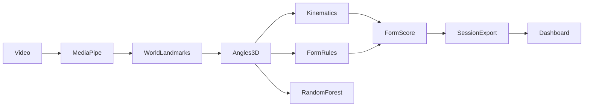

# BioVision AI

**3D biomechanical posture analysis platform** for gym exercises: extract MediaPipe **world landmarks**, compute **3D joint angles**, train scikit-learn classifiers, run **live webcam inference** with rep counting, form scoring, error detection, analytics, and optional **3D skeleton visualization**.

**Stack:** Python 3.9+, OpenCV, MediaPipe Pose, NumPy/Pandas, scikit-learn, Plotly, Streamlit, YAML configuration.

---

## Features

| Capability | Description |
|------------|-------------|
| **3D biomechanics** | Elbow/knee/hip flexion, shoulder abduction/flexion, trunk inclination, spine alignment, pelvic tilt |
| **Kinematics** | ROM, angular velocity/acceleration, stability, symmetry, smoothness, trajectory consistency |
| **23+ exercises** | Config-driven library in `config/exercises.yaml` |
| **Error detection** | Exercise-specific rules (squat valgus, deadlift rounded back, pushup hip sag, etc.) |
| **Form scoring** | Weighted 0–100 score (ROM, stability, symmetry, tempo, posture) |
| **3D visualization** | Interactive Plotly skeleton with `--3d-view` |
| **Analytics dashboard** | Streamlit app for session trends, errors, ROM |
| **Model comparison** | Random Forest vs Gradient Boosting vs XGBoost |

---

## Prerequisites

- **Python 3.9+** (macOS Apple Silicon, Windows, Linux)
- **Webcam** for live inference
- Exercise videos under `Data/` (local only, not in Git)

---

## Quick Start

```bash
git clone https://github.com/hrshilll/Biovision-AI.git
cd Biovision-AI

python3 -m venv .venv
source .venv/bin/activate   # Windows: .venv\Scripts\activate
pip install --upgrade pip
pip install -r requirements.txt
```

### Configure data directory

Set your video root via environment variable (recommended):

```bash
export BIOVISION_DATA_DIR="/absolute/path/to/Biovision-AI/Data"
```

Or edit `config/settings.yaml`:

```yaml
paths:
  data_dir: "Data"
```

### Dataset layout

```text
Data/
├── Bicep_curls/
│   ├── good/
│   └── bad/
├── Squats/
│   ├── good/
│   └── bad/
└── ...
```

---

## Pipeline

### 1. Build dataset (3D angles + legacy columns)

```bash
python create_dataset.py
```

**Outputs:** `gym_dataset.csv`, `gym_dataset.xlsx`

Includes legacy columns (`Elbow_Angle`, etc.) **and** 3D columns (`Elbow_Flexion_3D`, `Trunk_Inclination_3D`, …) for backward compatibility.

### 2. Train classifier + model comparison

```bash
python train_model.py
```

**Outputs in `models/`:**
- `form_classifier.pkl`, `scaler.pkl`, `label_encoder.pkl`, `feature_columns.pkl`
- `training_report.txt`
- `model_comparison_report.txt` (RF vs GB vs XGBoost)

### 3. Live inference

```bash
python live_inference.py
python live_inference.py --3d-view   # opens session_results/skeleton_3d_live.html
```

Press **SPACE** or **Q** to stop and save session CSV/XLSX + analytics report under `session_results/`.

### 4. Offline form analysis

```bash
python analyze_form.py
```

### 5. Analytics dashboard

```bash
streamlit run src/dashboard/streamlit_app.py
```

Pages: Session Summary, Form Analysis, Exercise Trends, Error Breakdown, ROM Analysis.

---

## Architecture

```text
Biovision-AI/
├── config/
│   ├── settings.yaml          # Global paths, pose tuning, scoring weights
│   └── exercises.yaml         # Exercise library (joints, thresholds, rep logic)
├── src/
│   ├── biomechanics/          # angles_3d, kinematics, posture_metrics
│   ├── exercises/             # config loader, rep counter, form scorer
│   ├── exercise_rules/        # squat, deadlift, pushup, curl, lunge rules
│   ├── visualization/         # Plotly 3D skeleton
│   ├── analytics/             # Session metrics & export
│   ├── models/                # Training & comparison
│   ├── pipeline/              # Dataset builder, live runner
│   ├── dashboard/             # Streamlit app
│   └── utils/                 # Config, logging, pose extraction
├── tests/                     # pytest unit tests
├── create_dataset.py          # Entry point
├── train_model.py
├── live_inference.py
└── analyze_form.py
```

### Data flow



---

## Form Scoring

Universal score **0–100** with default weights:

| Category | Weight |
|----------|--------|
| ROM | 30% |
| Stability | 25% |
| Symmetry | 20% |
| Tempo | 15% |
| Posture | 10% |

Per-exercise overrides in `config/exercises.yaml`.

---

## Exercise Library

**Original:** Bicep Curl, Squat, Pushup, Plank, Deadlift

**Added:** Lateral Raise, Front Raise, Shoulder Press, Bench Press, Tricep Extension, Pull Up, Lat Pulldown, Bent Over Row, Lunges, Bulgarian Split Squat, Leg Press, Calf Raise, Romanian Deadlift, Crunch, Sit Up, Mountain Climber, Russian Twist, Side Plank

Add new exercises by editing `config/exercises.yaml` — no code changes required.

---

## Testing

```bash
pip install -r requirements.txt
pytest -v
```

---

## Migration Notes

1. **Existing models remain compatible** — legacy angle columns are still produced and used as primary ML features.
2. **Retrain recommended** — rerun `create_dataset.py` and `train_model.py` to include 3D features in comparison reports.
3. **Config-driven rules** — hardcoded `RULES`/`REP_CONFIG` in old scripts replaced by YAML; root scripts now delegate to `src/`.
4. **Environment variable** — use `BIOVISION_DATA_DIR` instead of editing `BASE_DIR` in scripts.
5. **3D view** — requires Plotly; generates `session_results/skeleton_3d_live.html` (refresh browser during session).

---

## Troubleshooting

| Issue | Solution |
|-------|----------|
| `ModuleNotFoundError: src` | Run scripts from project root; `pytest.ini` sets `pythonpath=.` |
| No dataset rows | Check `BIOVISION_DATA_DIR`, `good`/`bad` folders, lighting |
| XGBoost skipped | Optional; install via `pip install xgboost` (included in requirements) |
| 3D view not updating | Open `session_results/skeleton_3d_live.html` and refresh every few seconds |
| macOS camera | System Settings → Privacy → Camera → allow terminal/IDE |

---

